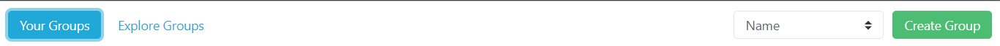
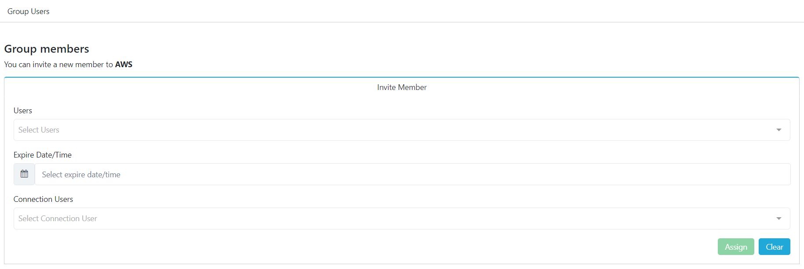
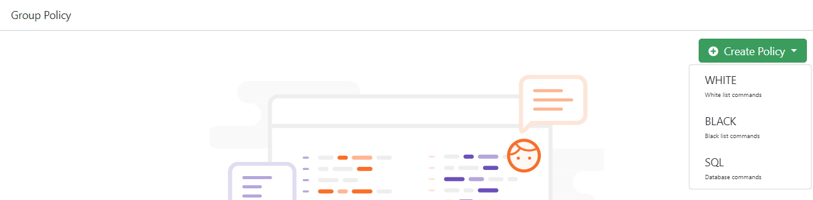
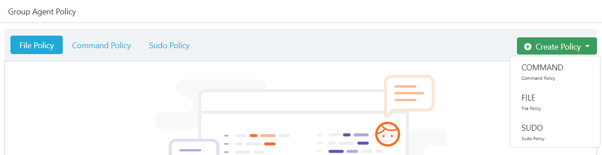
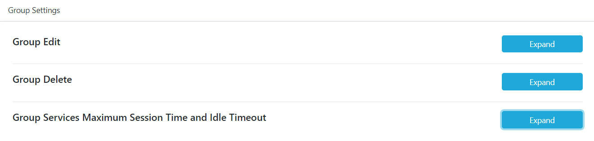

# Group Detail

___
Under the Groups header, Admin can see both "Your Groups" and "Explore Groups", "Your Groups" describes the groups that admin already involved. Thus, "Explore Groups" describes the groups that admin does not get involved in.  

## Crate Group

___
There is a green button that you see on the right side of the screen that is "Create Group" under that button admin can fix and make new groups.

## Your Groups 

___

You can see the groups you are registered with here.

## Explore Groups

___

You can view public groups here.

## Group Activities

___

Here you can follow the movements of the group members.

**Live Session:** It shows the users that make transactions in the Service.  
 **Agent Commands:**  
 **Agent Authentication Logs:**  
 **Agent File Logs:**  
 **Break the Glass:**  

## Users

___

You can add new member to the group

## Crate Policy

___

You can create a policy for group members by choosing one of the **white**, **black** and **sql** policy options.

 **White Option:** The whitelist only shows comments allowed by a group admin.  
**Black Option:** Represents blacklist, banned or blocked comments.  
**SQL Option:** It serves to make restrictions on the database.  

## Alarms

___

A regular expression is determined and if anyone uses the specified regular expression, it will send an alarm to the selected users.

## Agent Policy

___

## Group Settings

___

The page where the settings related to the group are edited.

