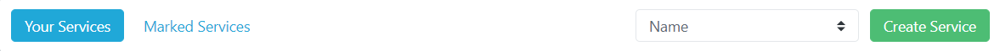
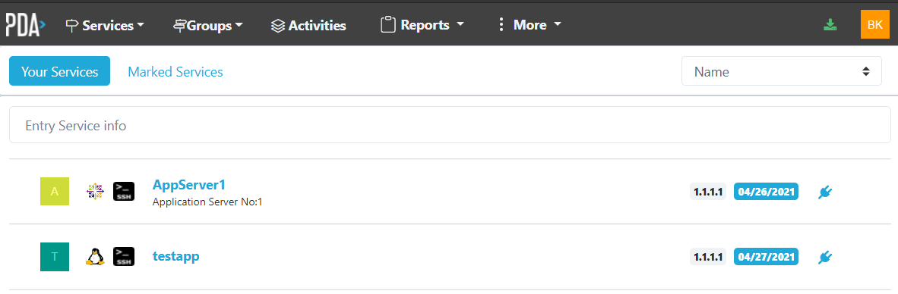
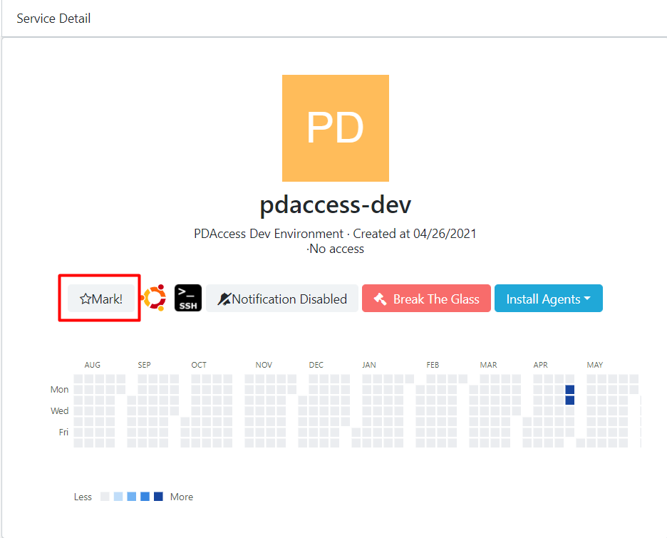
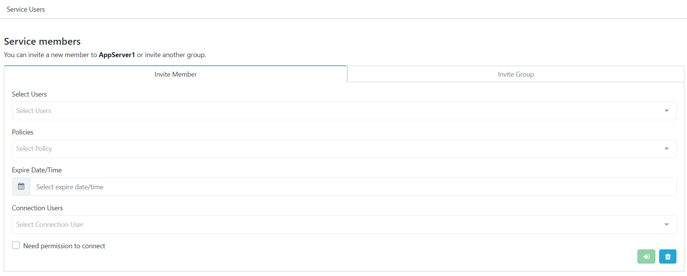
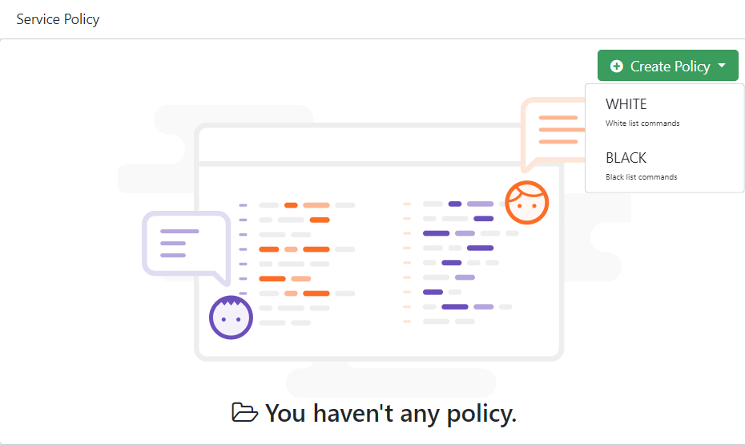
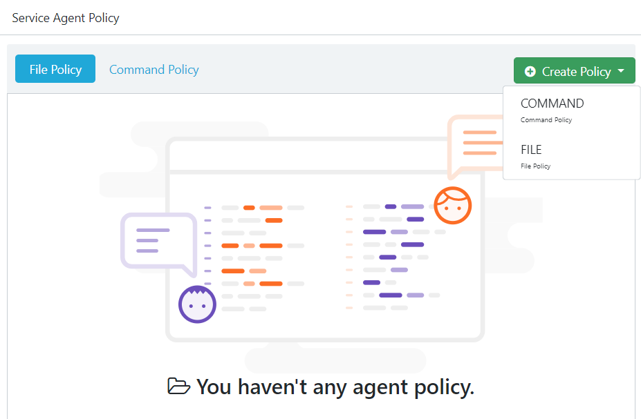
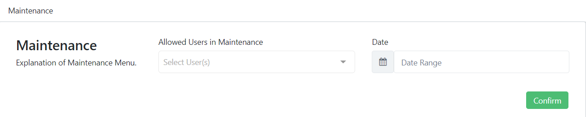
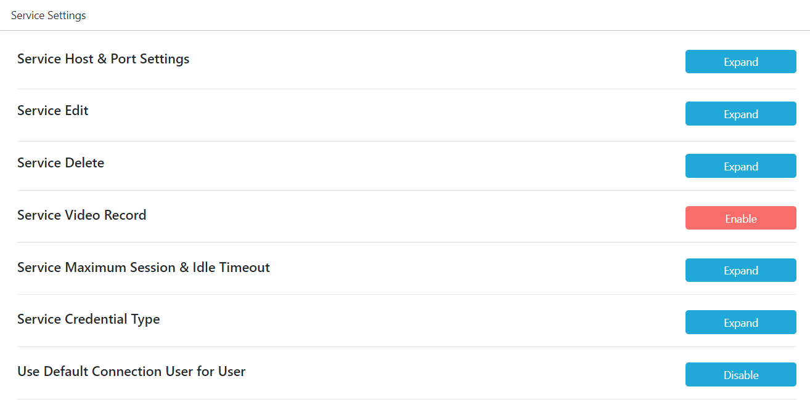

# Service Detail

___
Under the services header you can check all kinds of services that conditioned on PDAccess.

## Create Service

___
There is a green button that you see on the right side of the screen that is "Create Services" under that button admin can fix and make new services.

## Your Service  

___

Here you can see the services you have registered for.

## Marked Service

___

The services you mark appear here. If you want to mark a service, simply enter the service and press the mark button.

## Service Activity

___

Here you can follow the actions of the users.

**Live Session:** It shows the users that make transactions in the Service.  
 **Sessions:** It shows the operation performed by the connected user in the service.  
 **Actions:**  Shows the last operations performed on the service.  
 **Agent Commands:**  
 **Agent Authentication Logs:**  
 **Agent File Logs:**  
 **Break the Glass:**  
 **Credantials:**  

## Local Accounts

___

## Members

___

You can add a new user to the service or add a group and add all users within that group to the service.

## Crate Policy

___

You can continue the services by choosing one of the **white** or **black** policy options.  
 **White Option:** Whitelist only shows comments allowed by a group admin.  
**Black Option:** Blacklist represents banned or blocked comments.  

## Crate Agent Policy

___

**Command Policy:**  
**File Policy:** 

## Maintenance

___

## Service Settings

___

 You can change the settings of the service.

**Service Host & Port Settings:** You can update service host and port but we will not see current host and port data, if you want see this data use must Break The Glass.  
 **Service Edit:** You can make updates about your service by changing the name and description of the specified service.  
 **Service Delete:** You can delete the service by entering the first 3 characters of the service name.  
 **Service Video Record:**  
 **Service Maximum Session & Idle Timeout:** You can update service session maximum time and idle timeout.  
 **Service Credential Type:** You can change the service credential.
- **Transparent:** In Transparent mode PDAccess will use users login credentials
- **Vault:** In Vault mode PDAccess will store credentials and allows to change it.
- **Auto:** In Auto mode PDAccess will manage credentials itself(recomended).

**Use Default Connection User for User:** 